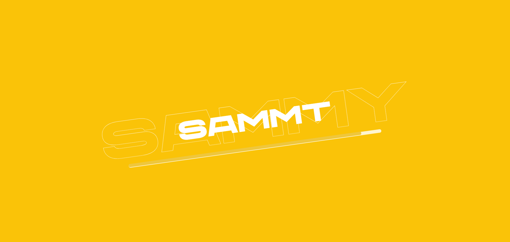
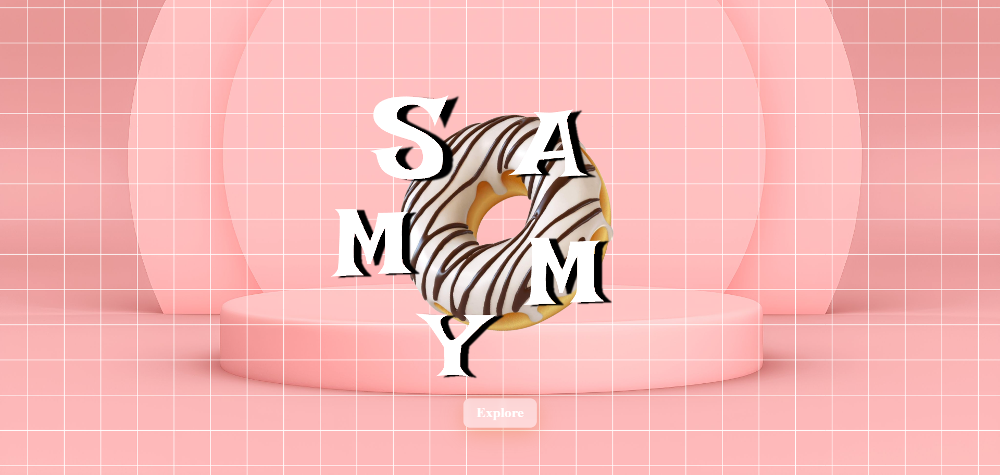

# 🌟 Animated Website Showcase with HTML, CSS, JS, and GSAP 🚀

Welcome to a world of dynamic web experiences! Explore the magic of cutting-edge web development with this repository, where I've meticulously crafted a captivating website using HTML, CSS, and JavaScript, amplified by the powerful animations of GreenSock Animation Platform (GSAP).

## Key Features:

✨ Seamless Animations: Elevate user engagement with fluid and mesmerizing animations powered by GSAP.
🎨 Stylish Design: Immerse your audience in an aesthetically pleasing environment, designed with a keen eye for visual appeal.
🚀 Responsive Layout: Ensuring a flawless experience across devices, this website adapts gracefully to different screen sizes.

## Technologies Used:

💻 HTML: The foundation of the web, providing structure and semantics.
🎨 CSS: Styling to perfection, ensuring a polished and professional look.
🚀 JavaScript: Adding interactivity and dynamism to the user experience.
🔥 GSAP: Unleashing the full potential of animations, making your website come alive.
How to Experience the Magic:

## 🌐 Clone the repository to your local machine.

🚀 Open the index.html file in your preferred browser.
✨ Explore and interact with the animated elements to witness the seamless flow of creativity.
Contribute and Enhance:

## 🌟 Excited to contribute? Feel free to fork the repository and add your creative touch to the project. Pull requests are always welcome!

Embark on a journey through the realms of web development artistry. Witness the synergy of code and creativity, and let your website leave an indelible mark on visitors.

## 📷 Screenshots:

